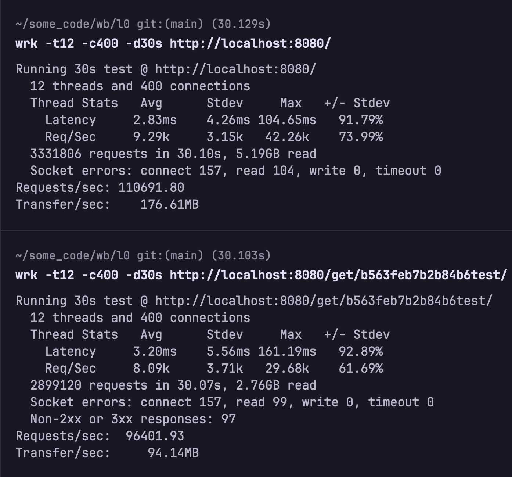

# wb_l0
## Level # 0 WB tech task

### Description
Demo service with a simple interface displaying order data by order UID.
Provides an HTTP endpoint for retrieving order data from cache.
Processing messages received from a NATS Streaming server to insert order data to database and cache.
### Video
https://github.com/DmitriyKost/wbl0/assets/127626954/b6cc719b-2234-4278-a92e-6c81eb969c54
### Running the service
To run the service you might need to edit [config file](./config/wbl0_vars.env).

Once edited configuration, execute following command to run the tests:
```sh
go test .
```
If passed all the tests, run the app by following commands:
```sh
go build cmd/main.go
./main
```
### wrk benchmarking

